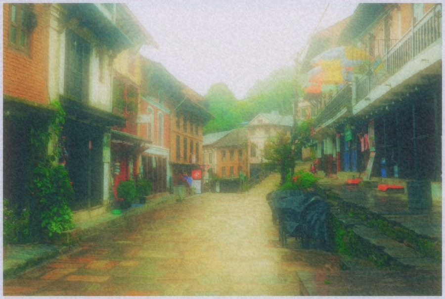
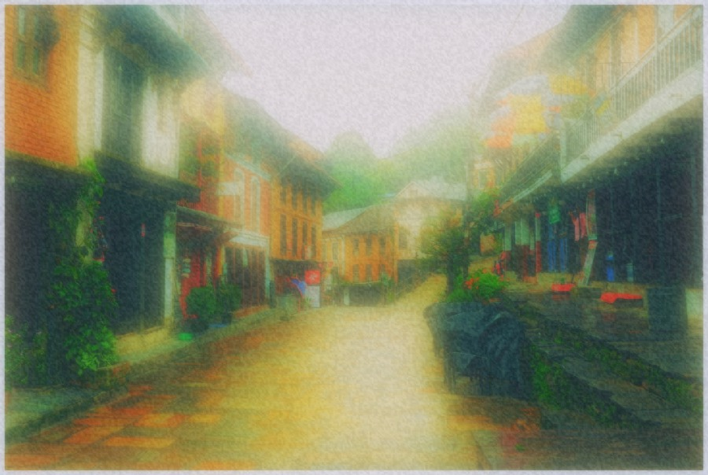
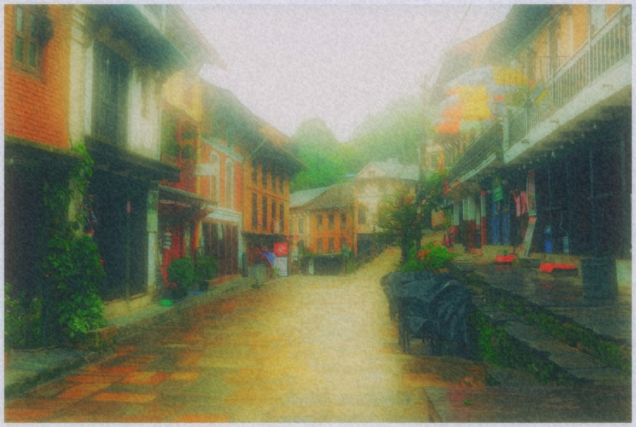
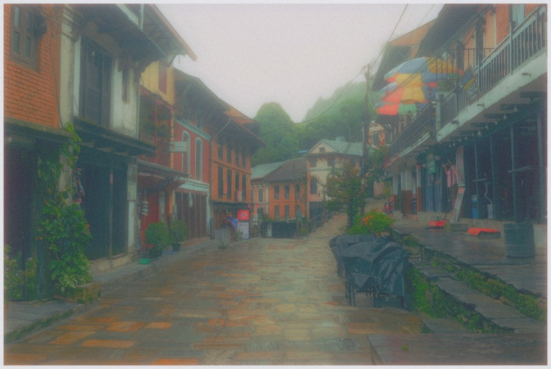
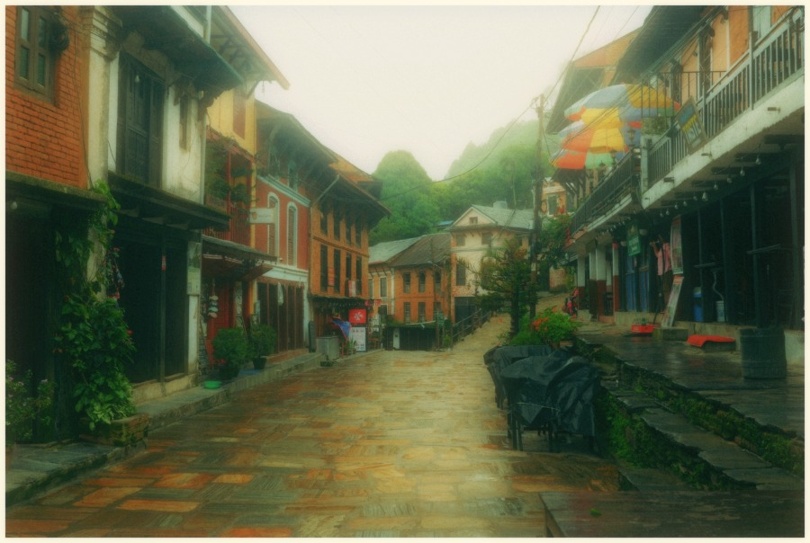
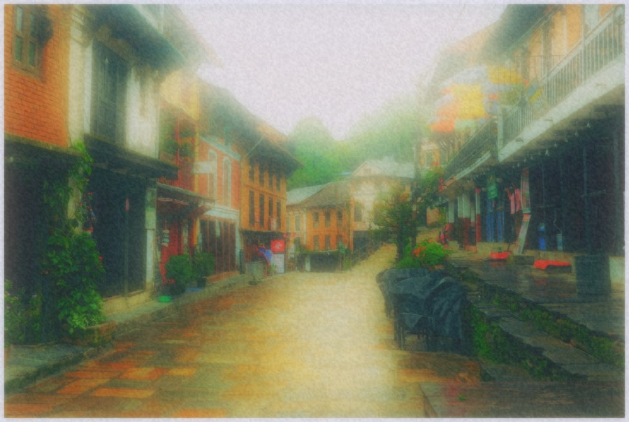
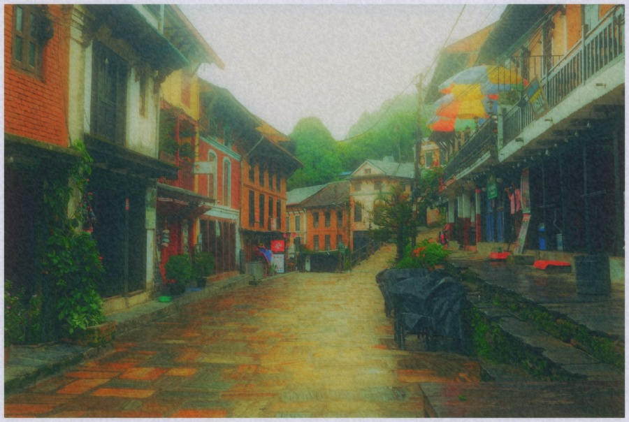

# Dream Bloom · User-made looks

Eight original recipes by **skarn03**, bundled with Lith. Open **Looks → filter icon → User-made · Dream Bloom**. Click to preview, then choose **Apply look** beside the photograph. Adjust the strength in Selected looks; 25–60% is a useful starting point for the denser diffusion recipes.

Download any `.lithlook` file below and use **Looks → Import or share looks → Import look**. Importing adds a personal copy to My looks. You can also export the bundled recipes through Share look.

The examples apply each recipe at 100% to the same already-edited [source photograph](../../docs/images/sample-town.jpg). These are creative bloom and diffusion recipes, not a claim of optical equivalence to a physical filter.

Only color and effect parameters are included. No source photos, file paths, masks, captions or crop settings are embedded.

## Daylight Veil

A brighter mix of vivid color and velvet diffusion, with softer orange saturation.

[Download Daylight Veil](daylight-veil.lithlook)

## Dreamspill

An intensified blend of Luminous Drift and Velvet Bloom for an enveloping mist.

[Download Dreamspill](dreamspill.lithlook)

## Luminous Drift

Velvet Bloom and Vivid Reverie blended into a layered, luminous haze.

[Download Luminous Drift](luminous-drift.lithlook)

## Midnight Halo

Cool cinematic color with lifted shadows, soft diffusion and strong halation around bright lights.

[Download Midnight Halo](midnight-halo.lithlook)

## Moss & Mist

Green midtones, cool highlights and a soft orange bloom. A hazy, cross-processed afternoon.

[Download Moss & Mist](moss-and-mist.lithlook)

## Sage Cinema

Pastel film color with sage midtones, blue shadows and a broad, dreamy glow.

[Download Sage Cinema](sage-cinema.lithlook)

## Velvet Bloom

A saturated, heavily diffused take on Sage Cinema, with an extra layer of glow and halation.

[Download Velvet Bloom](velvet-bloom.lithlook)

## Vivid Reverie

Sage Cinema with richer color. A vivid companion to the softer pastel recipe.

[Download Vivid Reverie](vivid-reverie.lithlook)

