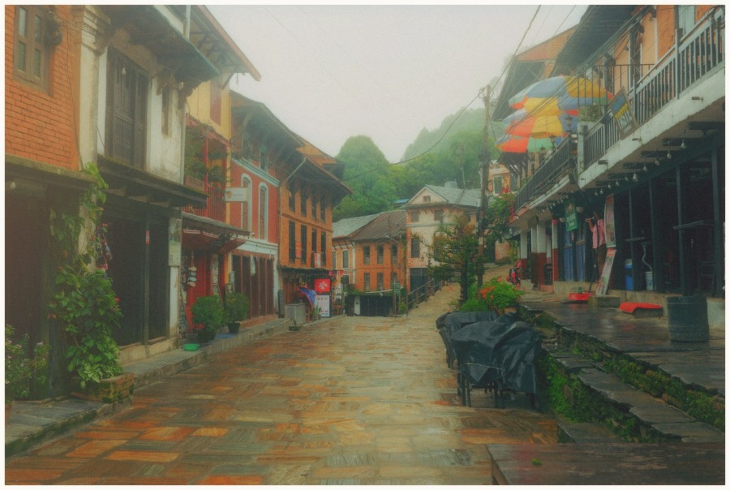
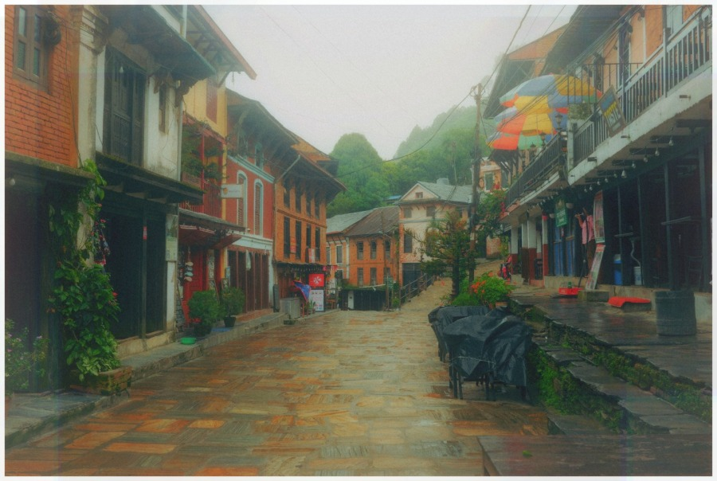
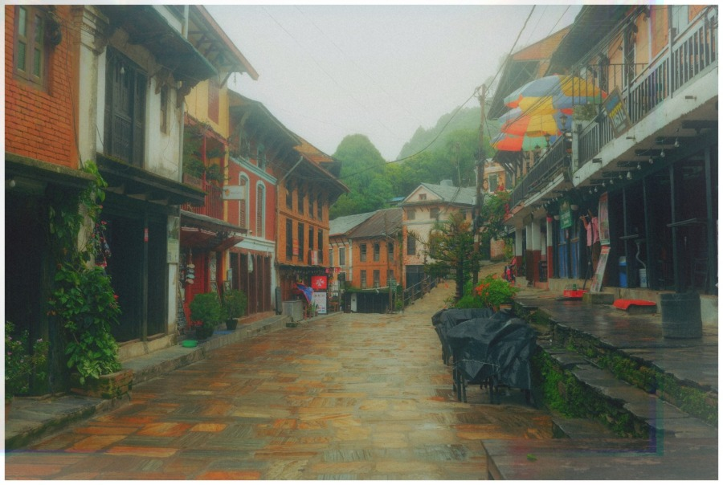
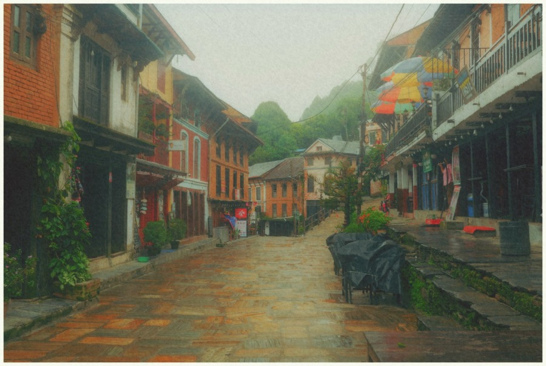
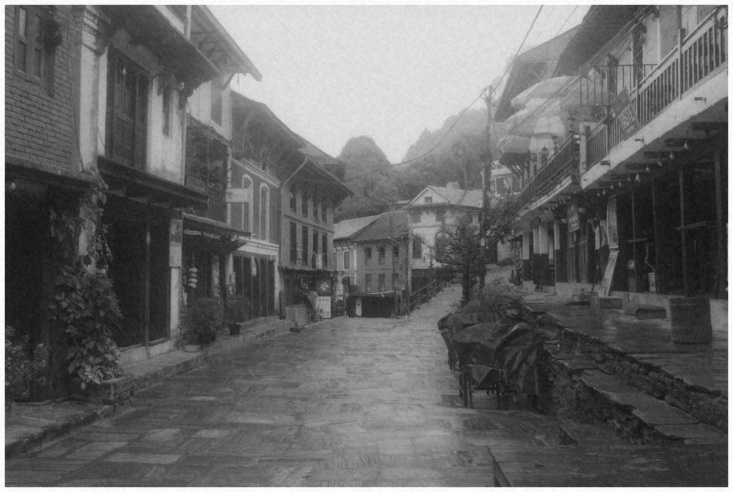
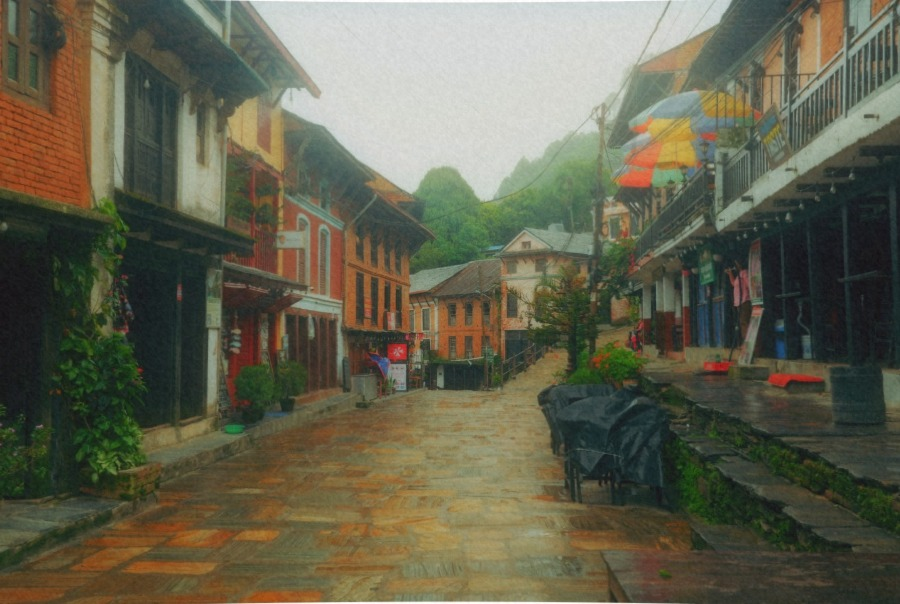
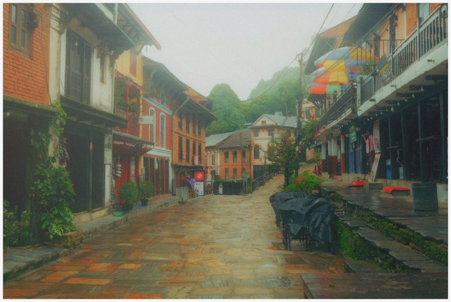

# Light Studies · Effects recipes

Twelve Lith-created recipes, credited to **Lith Studio**, built from the existing editing effects. Find them in **Looks → filter icon → User-made · Light Studies**. Your original **Dream Bloom** collection remains separate.

Click to preview, choose Apply look, then adjust strength in Selected looks. Bokeh and placed light use fixed positions; they do not detect the subject. These are artistic effect combinations, not physical lens or lighting simulations.

Examples below are real Lith exports at full strength, all using the same [already-edited source](../../docs/images/sample-town.jpg). Lower strength is recommended for the stronger recipes.

## Amber Afterglow

A warm edge leak over a gently faded darkroom print. Best with backlight; try 40–75%.

[Download look](amber-afterglow.lithlook)

## Blue Velvet

Cool shadow grading and black-mist diffusion with warm halation. Designed for evening light at 50–85%.

[Download look](blue-velvet.lithlook)

## Lantern Bokeh

Warm light discs at the outer edges with subtle diffusion. Fixed placements avoid the center; try 25–55%.

[Download look](lantern-bokeh.lithlook)

## Neon Echo

Prism reflections, narrow blue flare and halation for neon streets. Needs bright sources; start at 35–65%.

[Download look](neon-echo.lithlook)

## Passing Hours

Horizontal shutter trails with a softly protected central subject. For motion and street scenes; try 30–65%.

[Download look](passing-hours.lithlook)

## Pearl Mist

Soft white diffusion, gentle bloom and protected highlights. Start at 60–100% for portraits and overcast light.

[Download look](pearl-mist.lithlook)

## Prism Whisper

A restrained glass reflection and spectral edge color, with a protected center. Try 30–65%.

[Download look](prism-whisper.lithlook)

## Rain on Glass

Fine downward motion, color bleeding and cool mist. A stylized impression, not simulated raindrops; try 40–70%.

[Download look](rain-on-glass.lithlook)

## Rose Paper

A warm paper print with rose midtones, gentle grain and lifted blacks. Try 60–100%.

[Download look](rose-paper.lithlook)

## Silver Lantern

Monochrome with soft highlight glow and a cool paper base. Works with windows and lamps at 60–100%.

[Download look](silver-lantern.lithlook)

## Wide Awake

Gentle fisheye curvature with a warm analog fade and color bleed. Best for architecture and wide scenes at 30–60%.

[Download look](wide-awake.lithlook)

## Windowlight

A broad warm light placed at the upper left with a soft highlight roll-off. Artistic lighting; try 30–70%.

[Download look](windowlight.lithlook)

