# Photographs made with Lith

[Download Lith](https://github.com/skarn03/lith/releases/latest) · [Explore the features](../../README.md)

A selection from the creator’s exported photographs: quiet streets, grain, glow and everyday light. These are existing edits, not demonstrations of a particular preset.

13 photographs and two historical app screenshots were selected after visually reviewing 63 files. Images with visible or uncertain facial detail were left out. People seen from behind, covered faces and indistinct silhouettes may still appear. These web-sized copies have no EXIF/GPS metadata; original files were not changed.

### A walk through green

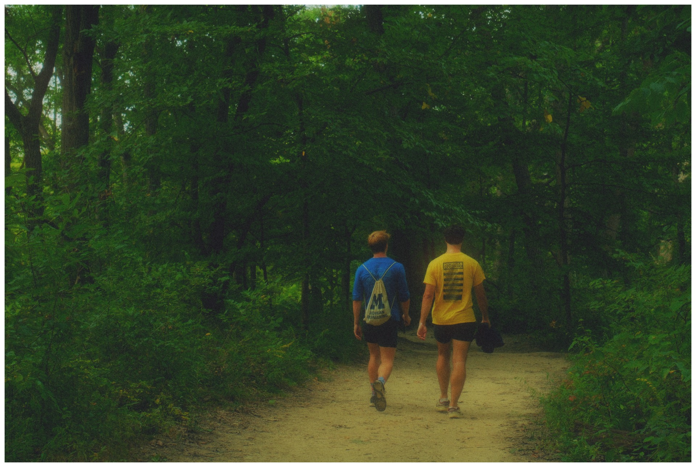

### Lamplight

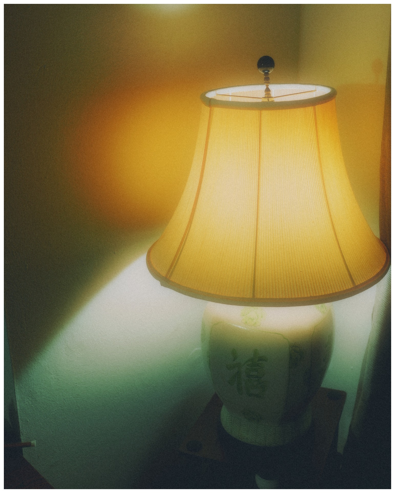

### Lantern alley

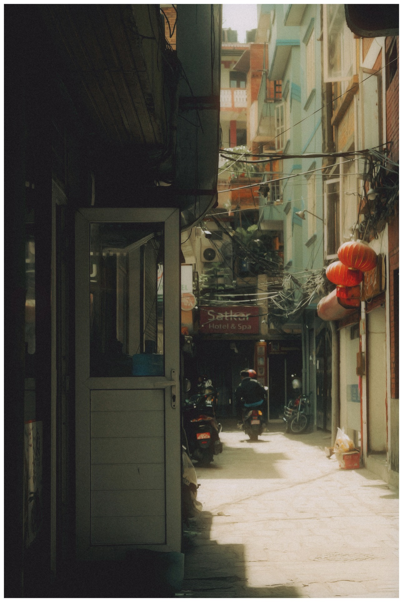

### Passing the shop

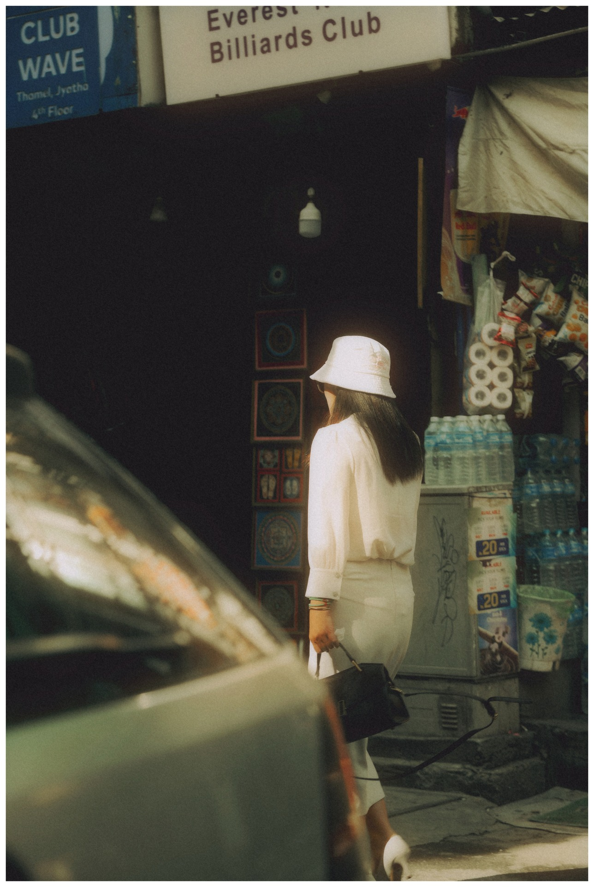

### Afternoon walk

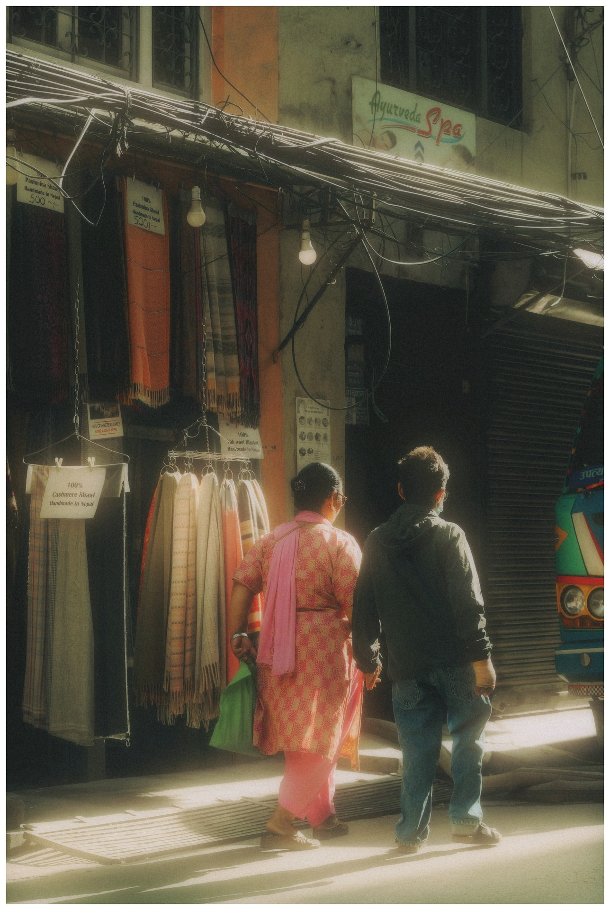

### Market shadows

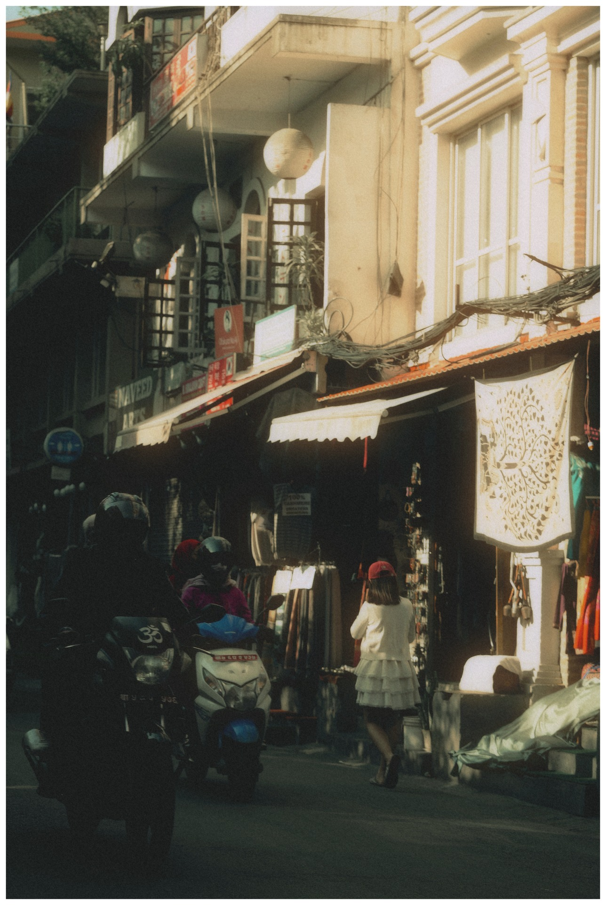

### Night lane

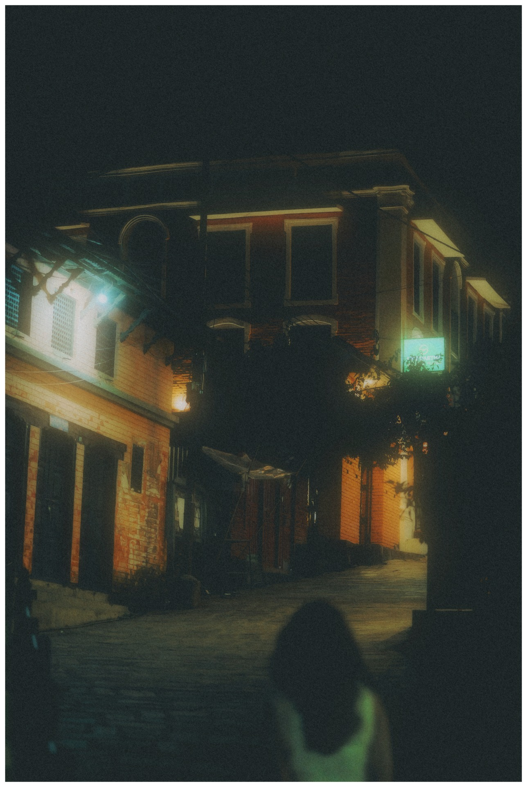

### After the rain

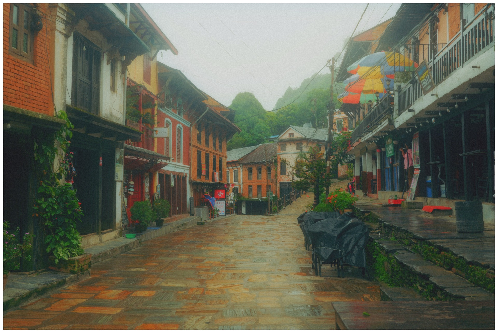

### Down the brick lane

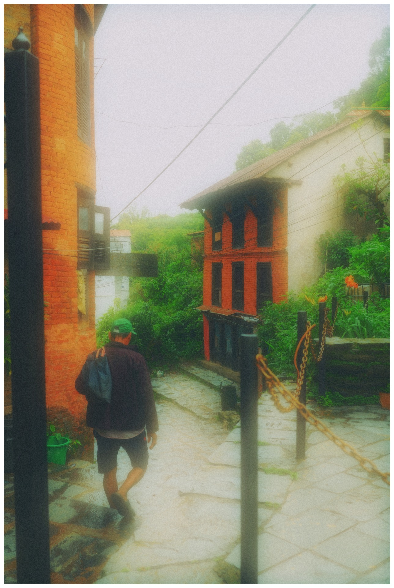

### City lights, vertical

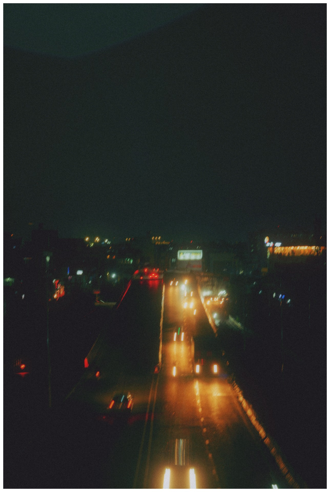

### City lights, wide

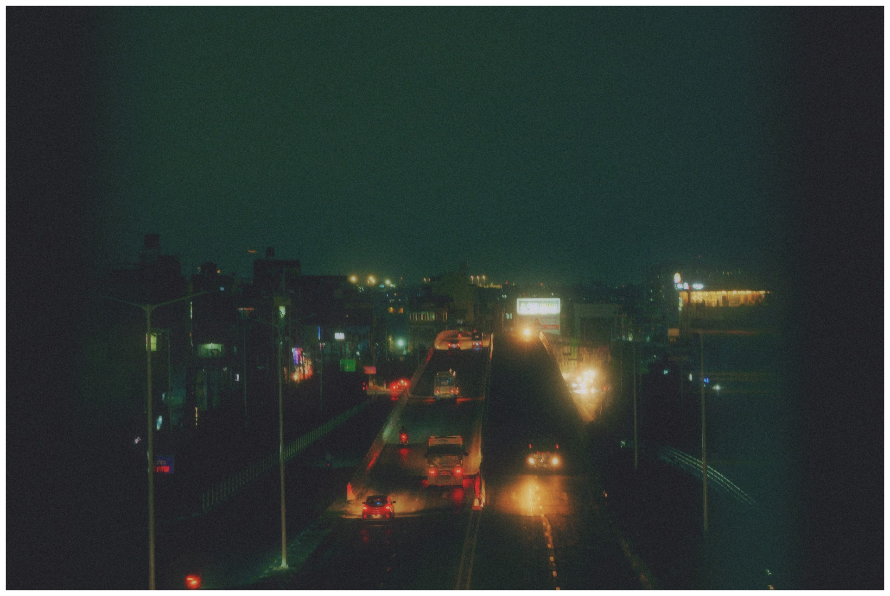

### City lights, alternate export

### Passing in a blur

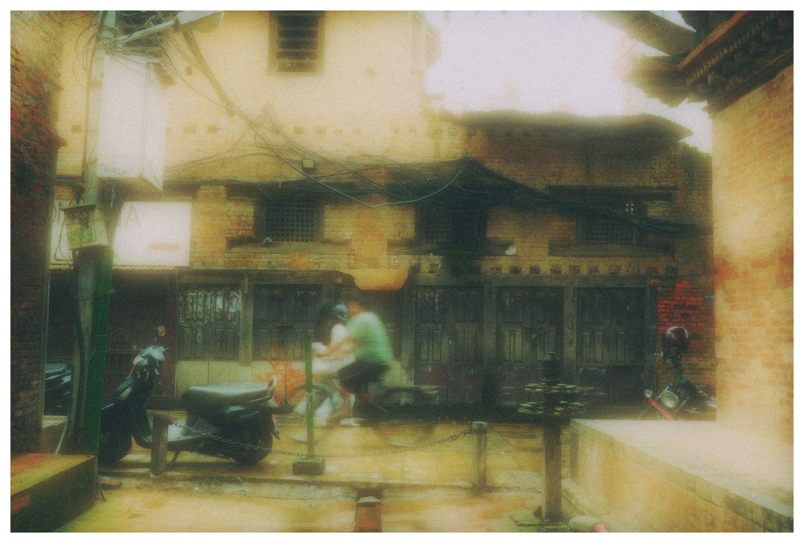

## Historical app screenshots

These two images were also in the export folder. They show an earlier version, not the current interface. See the main README for current screenshots.

### Early Lith logo

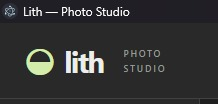

### Early Lith workspace

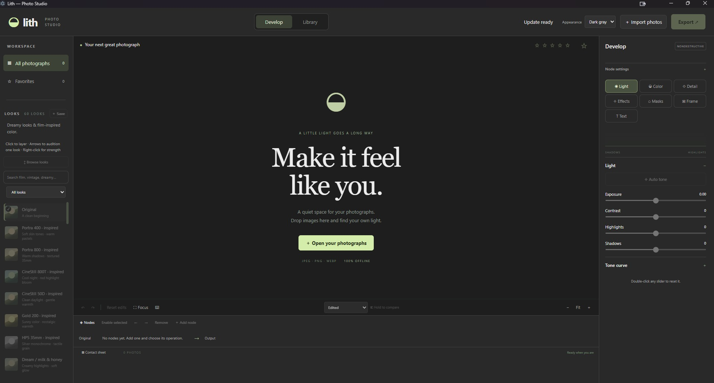
